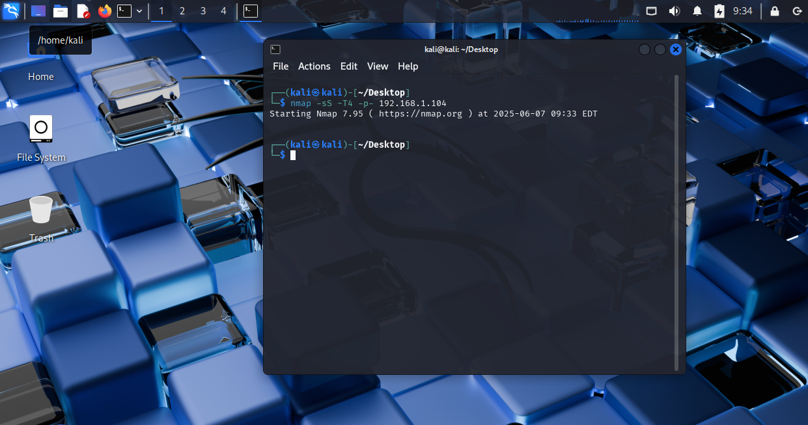
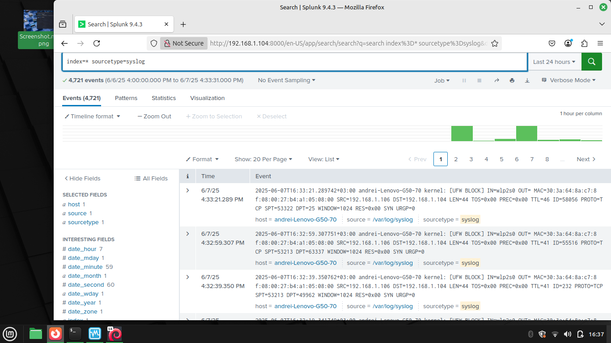
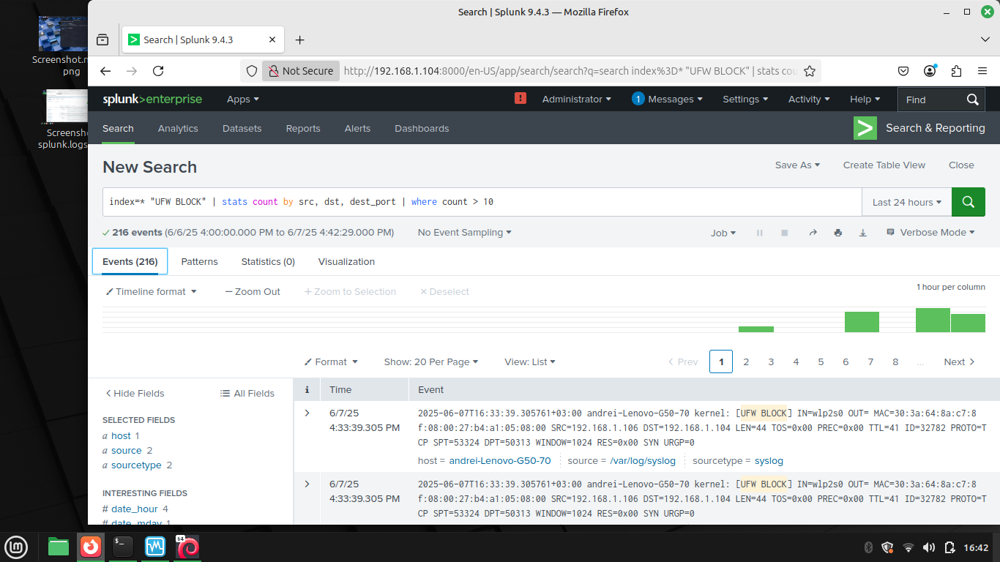
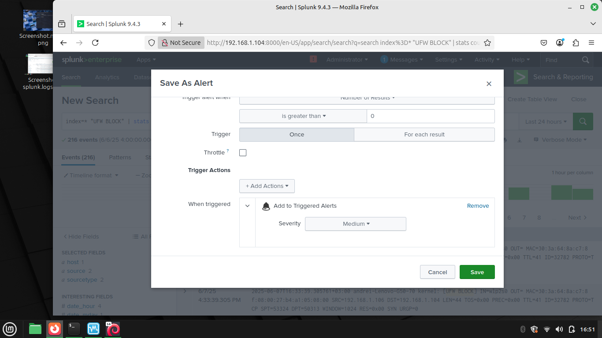
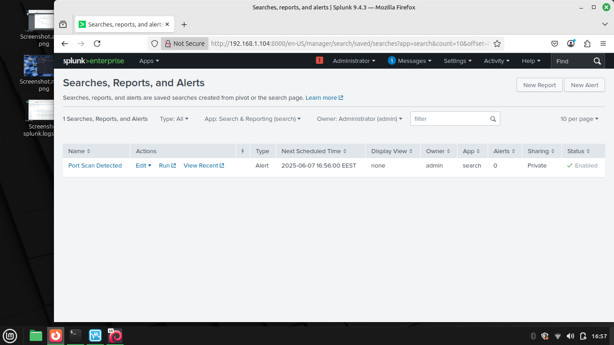

# Port-Scan-Detection:
- simularea unui atac de tip port scan de pe Kali Linux VM, colectarea logurilor pe host, Linux Mint, si analiza acestora in Splunk
# In acest proiect am folosit:
-Kali Linux VM pentru a genera atacul

-Linux Mint, host

-Splunk free
# Pasi:
1. Pe host, am activat logurile de firewall (sudo ufw enable, sudo ufw logging on)
2. Din Kali VM, am simulat un atac de tip port scan folosind Nmap (nmap -sS -T4 -p-)
3. Am importat logurile in Splunk (Data inputs - Files & Directories)
4. Am creat un query pentru a detecta sursele cu blocari multiple
5. Am creat o alerta in Splunk care sa detecteze port scan uri in timp real
# Screenshots:
Capturile de ecran ale proiectului:

